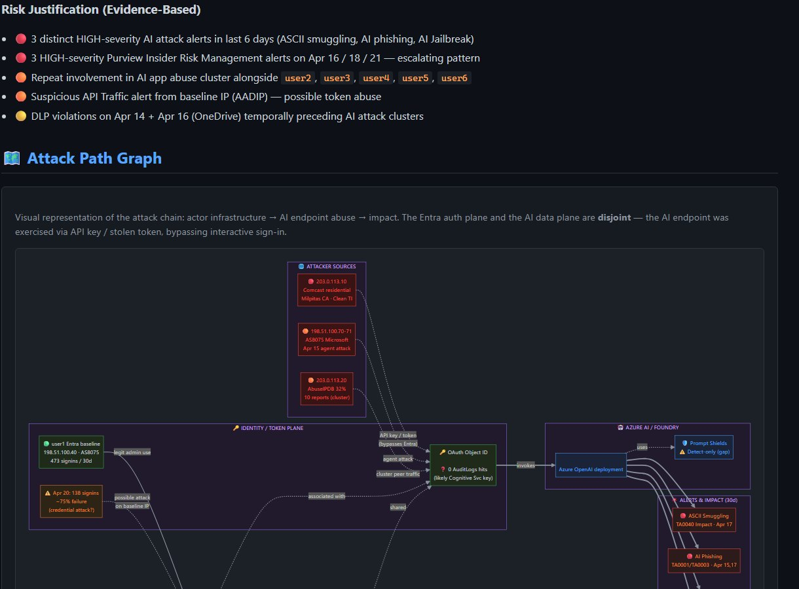
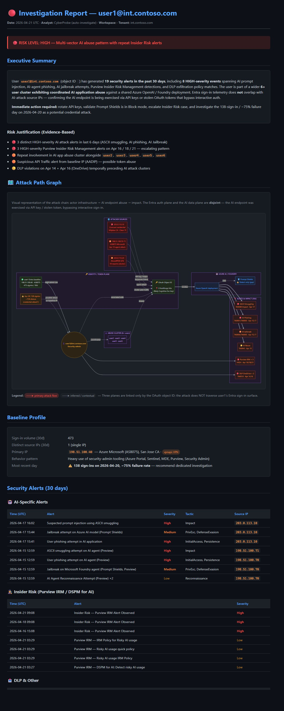

# Full Circle: From AI-Incident Investigation in VS Code to an Auto-Generated Sentinel Playbook — All in Natural Language

**Author:** Olivier Charron
**Date:** April 2026
**Tags:** #CyberSecurity #AI #SOC #MicrosoftSentinel #SecurityCopilot #GitHubCopilot #MCP #DetectionAsCode #Automation

---

## TL;DR

In a single afternoon I went from a raw AI-attack alert in Microsoft Sentinel to a **codified, production-ready response playbook** — without writing a single line of KQL or Python by hand.

The chain:

1. **Detect** — Defender for Cloud + Prompt Shields + Purview DSPM for AI fired alerts on a user.
2. **Investigate** — I opened VS Code, used **CyberProbe** with **GitHub Copilot + MCP servers** to run a full 3-phase investigation.
3. **Reason** — **Security Copilot (E5)** added executive context and attack-path reasoning.
4. **Codify** — I pasted the investigation narrative into the **Microsoft Sentinel Playbook Generator (preview)** and it wrote a Python playbook that reproduces the investigation on every future alert.

One analyst. Natural language. Full SOC lifecycle.

---

## The Incident

An Entra user with heavy security-admin privileges started receiving a burst of AI-targeted alerts over a 6-day window:

| Date | Alert | Severity |
|------|-------|----------|
| 2026-04-15 | AI Agent Reconnaissance Attempt Detected (Preview) | Low |
| 2026-04-15 | ASCII smuggling attempt was detected on an AI agent (Preview) | High |
| 2026-04-15 | A user phishing attempt was detected on an AI agent (Preview) | High |
| 2026-04-15 | Jailbreak attempt on your Microsoft Foundry agent was blocked by Prompt Shields (Preview) | Medium |
| 2026-04-17 | Suspected prompt injection using ASCII smuggling detected | High |
| 2026-04-17 | A Jailbreak attempt on your Azure AI model deployment was detected by Prompt Shields | Medium |
| 2026-04-17 | A user phishing attempt detected in one of your AI applications | High |
| 2026-04-16 → 21 | 3× Purview IRM "Risky AI usage" + DLP "Restrict copilot by label" | Mixed |

Three attack vectors (ASCII smuggling, jailbreak, AI phishing) against the same user's Azure OpenAI deployment, with Purview Insider Risk backing it up. This was not an isolated alert — it was a campaign.

> 📸 **Screenshot placeholder 1** — Sentinel incident page showing the clustered AI alerts on the same user.

---

## Step 1 — Investigate from VS Code (CyberProbe)

I opened VS Code in the CyberProbe repo and typed one line to GitHub Copilot:

> *"Auto-investigate the user with the most AI-attack alerts in the last 7 days."*

Behind the scenes, CyberProbe chained these MCP servers automatically:

| MCP server | What it did |
|-----------|-------------|
| **Microsoft Sentinel Data Lake** | Queried 30-day `SigninLogs` baseline (473 sign-ins, 1 IP) |
| **Defender XDR Triage** | Pulled incident details, alert entities, MITRE mapping |
| **Microsoft Graph** | Resolved user profile, tenant context, OAuth object IDs |
| **Microsoft Learn** | Looked up current Prompt Shields & Purview DSPM docs |

CyberProbe's **`kql-auto-investigate`** skill ran the canonical 3-phase workflow:

1. **Triage** — identify entity, collect last-30-day alerts, baseline sign-ins
2. **Deep dive** — SessionId tracing, IP enrichment via AbuseIPDB + IPInfo + VPNapi + Shodan
3. **Correlation** — cross-user cluster detection, OAuth resource correlation

The key finding came out of Phase 2: the AI-attack source IP **did not appear anywhere** in the user's 30-day Entra sign-in history. That one fact collapsed the whole case. The AI API was being invoked **outside the Entra authentication flow** — meaning a stolen API key or exfiltrated session token, not a compromised user identity.

Phase 3 revealed the cluster: **6 users** sharing the same OAuth object ID on the same Azure OpenAI deployment. It was a systemic abuse pattern, not a single user's problem.

> 📸 **Screenshot placeholder 2** — VS Code with Copilot Chat running `kql-auto-investigate`, showing the Phase 2 `ai_api_bypass = True` flag.


*Fig. 1 — Attack Path Graph from the CyberProbe investigation report. Four planes (Attacker Sources · Identity / Token · Azure AI / Foundry · Alerts & Impact) are linked **only** by the OAuth object ID — the attack never traverses user1's Entra sign-in surface.*

---

## Step 2 — The Report

CyberProbe's `report-generation` skill produced a full HTML report with a dark-theme Mermaid attack-path diagram, MITRE mapping, IP enrichment tables, and a mandatory **Methodology** section citing every KQL query, every MCP tool, and every enrichment API.

📄 **Read the full sanitized report here:**
[investigation_user1_2026-04-21.html](https://github.com/olchar/CyberProbe/blob/main/reports/investigation_user1_2026-04-21.html)
📦 **Machine-readable JSON:**
[investigation_user1_2026-04-21.json](https://github.com/olchar/CyberProbe/blob/main/reports/investigation_user1_2026-04-21.json)
🌐 **IP enrichment:**
[ip_enrichment_6_ips_2026-04-21.json](https://github.com/olchar/CyberProbe/blob/main/reports/ip_enrichment_6_ips_2026-04-21.json)


*Fig. 2 — Full CyberProbe investigation report (dark theme). Sections: risk banner · executive summary · attack path graph · baseline profile · AI-specific alerts · Insider Risk · DLP · correlation findings · recommendations · methodology.*

---

## Step 3 — Security Copilot Reasoning (E5 / E7 benefits)

With **Security Copilot** enabled in the tenant, I promoted the incident into a guided investigation. The embedded AI produced an executive summary, reframed the MITRE tactics into plain-English business risk, and suggested a prioritized response plan. The **E5 / E7 AI benefits** ([see Microsoft's announcement](https://techcommunity.microsoft.com/blog/microsoft-security-blog)) give customers monthly Security Copilot usage units that make this kind of reasoning affordable at scale — no separate SKU negotiation required.

This is where the "AI for Security" layer earns its keep: not replacing the analyst's investigation, but **compressing the time** between raw findings and a decision an executive can sign off.

---

## Step 4 — Codify the Workflow as a Sentinel Playbook (Preview)

Here's the part that actually changed how I think about SOC work.

Microsoft recently shipped the **[Sentinel Playbook Generator (preview)](https://learn.microsoft.com/azure/sentinel/automation/generate-playbook)** — a Cline-based AI coding agent embedded directly in the Defender portal. You write natural language, it writes Python.

So I wrote a **spec document** for a playbook that reproduces what I had just done manually:

- Trigger on any AI-targeted alert (ASCII smuggling / Jailbreak / Prompt Shields / AI phishing / DSPM for AI)
- Pull the user's 30-day sign-in baseline via `runHuntingQuery`
- Check if the attacker IP is in the baseline → flag `ai_api_bypass`
- Enrich every source IP in parallel (AbuseIPDB + IPInfo + VPNapi)
- Resolve the OAuth object ID (Entra app → service principal → Azure resource)
- Cluster-correlate across all users with ≥2 AI alerts in 30d
- Compute a 3-tier risk score with a defensive decision tree
- Post a structured Markdown comment to the incident
- Gate the response actions by risk — **never auto-disable or auto-isolate from a triage playbook** (one-way doors belong in a separate high-confidence playbook)

📄 **The full playbook spec is published here:**
[ai-attack-triage-playbook.md](https://github.com/olchar/CyberProbe/blob/main/security-copilot/playbook-specs/ai-attack-triage-playbook.md)

I pasted the spec into the generator's **Plan mode**, reviewed the proposed flow diagram, approved, and switched to **Act mode**. The generator wrote the Python, the integration profile bindings, and the test harness. A single SOC ticket's worth of investigation is now **reusable infrastructure**.

> 📸 **Screenshot placeholder 5** — Sentinel Playbook Generator Plan-mode view with the AI-attack triage prompt pasted in.

> 📸 **Screenshot placeholder 6** — Act-mode output showing the generated Python playbook + flow diagram.

### The AI-Agent Trust Boundary

Here's the part nobody talks about: **the generator writes code. It doesn't tell you whether the code is safe.**

So the spec includes a 14-item validation checklist grouped into five categories — **Security · Reliability · Blast-radius · Observability · Regression**. It treats every generated playbook as untrusted until proven otherwise. It's the same discipline you'd apply to a pull request from a new team member, except the "team member" is a language model.

> 💡 This checklist is generic — it applies to *any* playbook the generator produces, not just this one. Save it, reuse it, make it part of your SOC's code-review kit.

If AI-generated automation is going to earn a place in production SOCs, the trust boundary has to be **explicit and testable**. A checklist like this is the minimum viable contract.

---

## The Full Circle

```
┌─────────────┐    ┌──────────────┐    ┌─────────────┐    ┌──────────────┐
│   DETECT    │ ──▶│  INVESTIGATE │ ──▶│    HUNT     │ ──▶│   AUTOMATE   │
│             │    │              │    │             │    │              │
│ Sentinel +  │    │ VS Code +    │    │ Copilot +   │    │ Playbook     │
│ Defender    │    │ GitHub       │    │ Security    │    │ Generator    │
│ XDR         │    │ Copilot +    │    │ Copilot E5  │    │ (Cline /     │
│             │    │ MCP +        │    │             │    │ Python /     │
│             │    │ CyberProbe   │    │             │    │ Natural Lang)│
└─────────────┘    └──────────────┘    └─────────────┘    └──────────────┘
       ▲                                                           │
       │                                                           │
       └──────── Back to detect (tune analytics from findings) ◀───┘
```

Every step is driven by **natural language**. Every artifact is **reproducible**. Every investigation becomes **reusable automation** — the core idea of **detection-as-code** extended to response-as-code.

---

## Licensing Prerequisites

Here's the honest part you need before trying this: the pipeline relies on multiple Microsoft surfaces, each with its own license. None of this is obscure, but it's worth naming explicitly.

| Capability | Required license / SKU | Notes |
|------------|------------------------|-------|
| **Microsoft Sentinel** | Sentinel data ingestion (pay-as-you-go) OR included in Microsoft Defender / E5 bundles | Required for `query_lake`, analytic rules, automation rules, playbooks. |
| **Microsoft Defender XDR** | Microsoft 365 E5 / E5 Security / standalone Defender plans | Required for incidents, Advanced Hunting, response actions. |
| **Defender for Cloud — AI workload protection** | Defender CSPM + Defender for Cloud plan with AI threat protection add-on | Generates the Prompt Shields / ASCII smuggling / AI phishing alerts. |
| **Microsoft Purview DSPM for AI + Insider Risk Management** | Microsoft 365 E5 Compliance / E5 Information Protection & Governance | Generates the "Risky AI usage" + IRM alerts used in the cluster correlation. |
| **Microsoft Security Copilot** | Security Compute Units (SCUs) — purchasable standalone, **or** monthly AI capacity benefits included with Microsoft 365 E5 / Microsoft 365 E7 (preview) | Enables embedded AI reasoning in Sentinel/Defender/Purview/Entra portals and the Playbook Generator. |
| **Sentinel Playbook Generator (preview)** | Security Copilot enabled + Sentinel Contributor RBAC + Entra "Detection Tuning" role | Limits: 100 playbooks/tenant, 5000 lines per playbook, 10-minute runtime, 8M tokens/day/tenant. Python only. |
| **GitHub Copilot** | GitHub Copilot Business or Enterprise (required for MCP tool usage in VS Code) | The IDE-side AI that drives CyberProbe investigations. |
| **VS Code + MCP servers** | Free (VS Code), individual MCPs free or self-hosted | `mcp.json` is shipped in the CyberProbe repo. |
| **CyberProbe itself** | MIT License, free, open-source | [github.com/olchar/CyberProbe](https://github.com/olchar/CyberProbe) |

> 💡 The Microsoft 365 **E5 / E7 bundles** increasingly include monthly Security Copilot capacity benefits — that's the path that makes this entire workflow economically accessible to most SOCs without a separate SCU purchase cycle. Check your EA terms with your Microsoft account team.

---

## What to Try First

If you want to reproduce this:

1. **Clone** [github.com/olchar/CyberProbe](https://github.com/olchar/CyberProbe), open in VS Code, install the MCP servers from `.vscode/mcp.json`.
2. **Run `kql-auto-investigate`** on one of your own AI-related alerts (or any incident).
3. **Generate the report** — notice the Methodology section; every query and tool call is cited. That's not a vanity feature; it's what makes the investigation auditable.
4. **Read the playbook spec** at [security-copilot/playbook-specs/ai-attack-triage-playbook.md](https://github.com/olchar/CyberProbe/blob/main/security-copilot/playbook-specs/ai-attack-triage-playbook.md) — it's paste-ready for the Sentinel Playbook Generator.
5. **Write the integration profiles** (Graph-Security, Graph-Defender-XDR, AbuseIPDB, IPInfo, VPNapi) in Sentinel Automation → Integration Profiles.
6. **Paste the spec** into the Playbook Generator's Plan mode, review, switch to Act mode.
7. **Validate** against the test harness in the spec (three known-good alert IDs).

---

## Closing Thought

We used to talk about "closing the loop" from detection to response. With natural-language AI agents in the loop — at every layer — the loop closes itself.

Investigation becomes executable.
Response becomes reviewable code.
The SOC becomes a place where every incident makes the next incident faster.

That's the full circle. And it's here now.

---

**References:**

- [Generate playbooks using AI in Microsoft Sentinel (preview)](https://learn.microsoft.com/azure/sentinel/automation/generate-playbook)
- [Microsoft Security Copilot overview](https://learn.microsoft.com/security-copilot/)
- [Microsoft Defender for Cloud — AI Threat Protection](https://learn.microsoft.com/azure/defender-for-cloud/ai-threat-protection)
- [Microsoft Purview DSPM for AI](https://learn.microsoft.com/purview/dspm-for-ai)
- [CyberProbe on GitHub](https://github.com/olchar/CyberProbe)
- [Investigation report — user1 AI-attack case](https://github.com/olchar/CyberProbe/blob/main/reports/investigation_user1_2026-04-21.html)
- [AI Attack Triage Playbook spec](https://github.com/olchar/CyberProbe/blob/main/security-copilot/playbook-specs/ai-attack-triage-playbook.md)

*#SOCAutomation #DetectionAsCode #PromptShields #DSPMforAI #PlaybookGenerator*
